# Superstore Time Series Sales Forecasting
Data science project that seeks to make a sales forecasting model to predict future sales for a global superstore to assist in optimizing pricing and marketing strategies. 

## Quick Links
- Streamlit app for interactive data and model predictions analysis: [Streamlit App](https://superstore-time-series-sales-forecasting.streamlit.app/)
- Jupyter Notebook of the development of the sales forecasting model: [Jupyter Notebook](sales_forecast.ipynb)
- Superstore sales dataset: [Superstore Sales Dataset](sales-forecasting-dataset/train.csv)
- Other projects I have made: [Portfolio Website](https://lucashoffschmidt.github.io/)

## Technologies Used
**Tools and Platforms**
- Development: Jupyterlab
- Deployment: Streamlit Community Cloud

**Libraries**
- Dataset Handling: `opendataset`
- Data Analysis: `pandas`, `numpy`
- Visualization: `matplotlib`, `seaborn`, `folium`
- Machine Learning: `scikit-learn`
- Statistical Modeling: `statsmodels`, `pmdarima`
- File System Operations: `os`
- Date and Time Handling: `datetime`
- Storage: `joblib`
- Deployment: `streamlit`

## Process
**Data Collection**
- Acquired the superstore sales dataset from kaggle, renamed the dataset folder and converted the dataset to a pandas DataFrame.
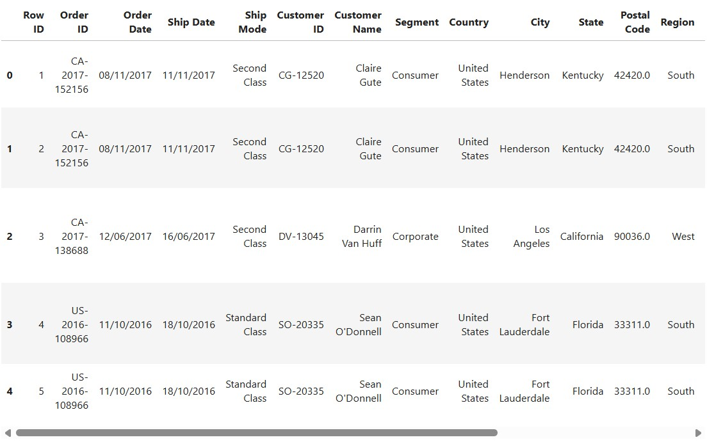
- Defined the attributes of the dataset.   

**Exploratory Data Analysis**
- Checked the dataframe for null values and incorrect data types and converted the date features Order Date and Ship Date to datetime format.
- Investigated the statistical distribution of attributes and created a histogram and boxplot of sales to check for skewness and outliers.
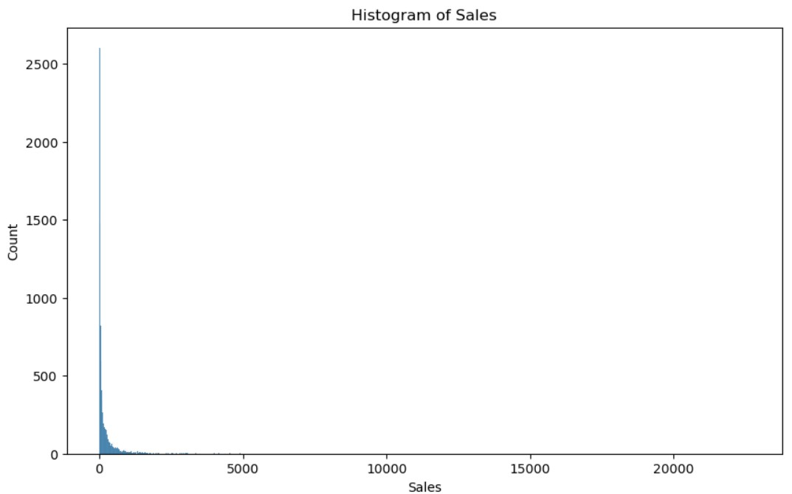
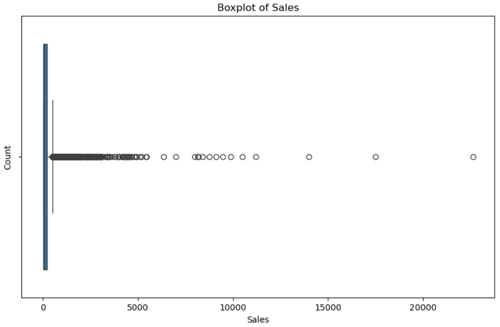
- Created new datetime features such as month and year and used them in lineplots to see how total sales fluctuate over time.
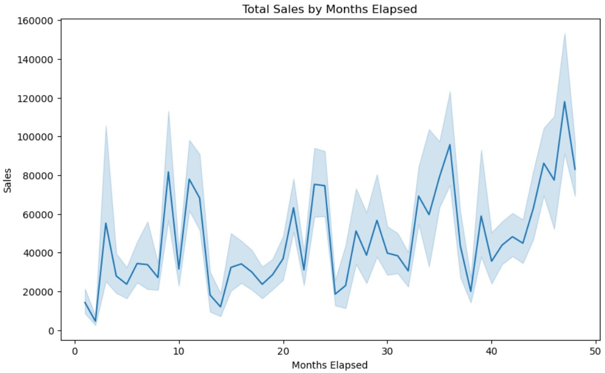
- Visualized how categorical features such as segment and region relate to total sales using barplots.
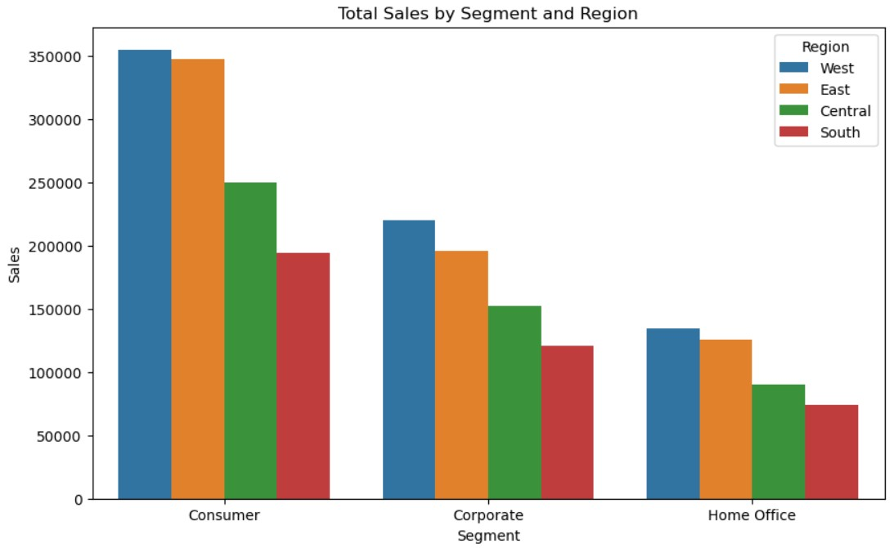
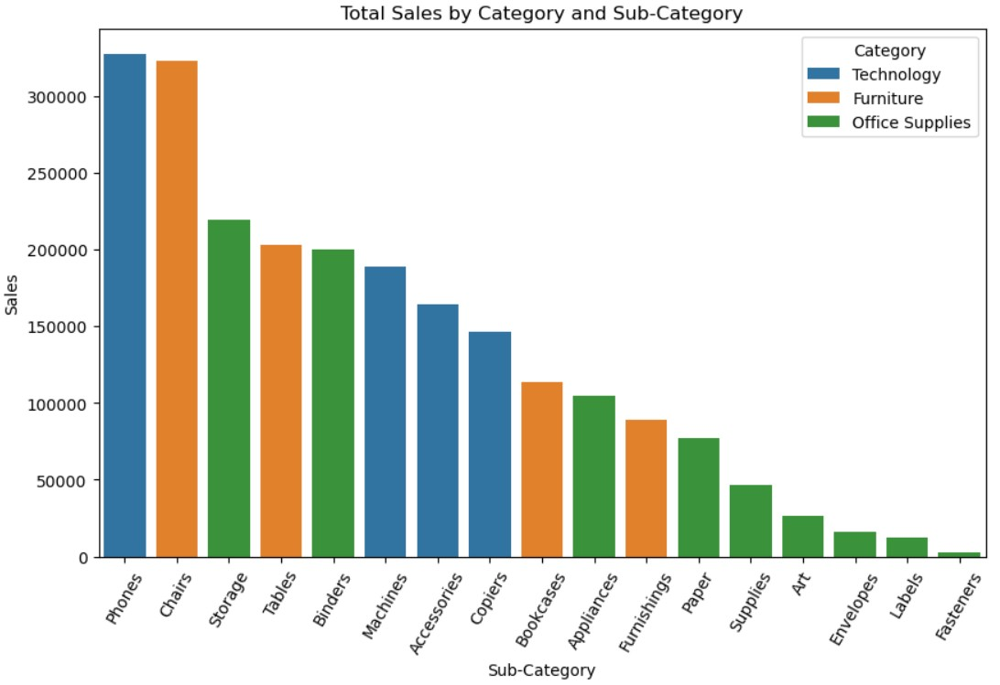
- Created an interactive map of total sales by state.
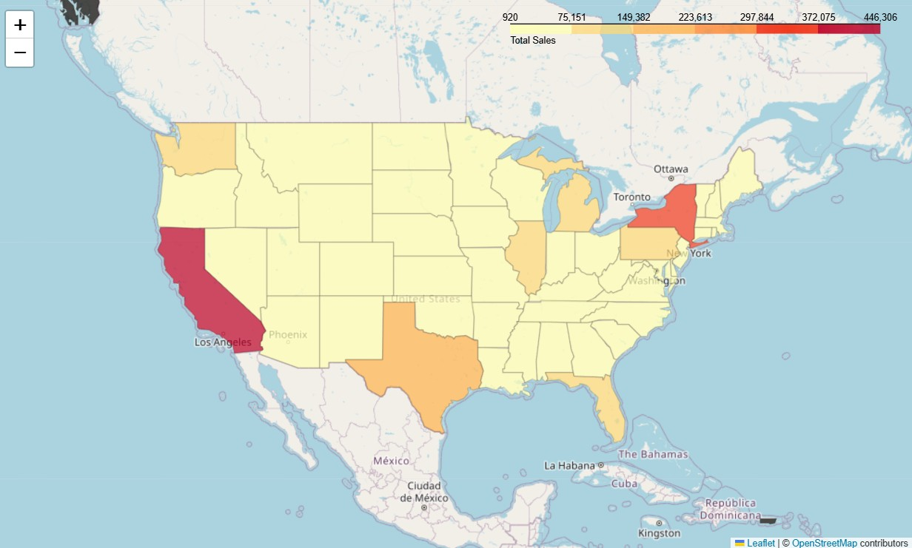 

**Data Preprocessing**
- Checked the dataframe for duplicates, invalid names and extra spaces.
- Dropped any feature that is not suitable for modeling, such as high cardinality features and features that are unknown at the time of forecasting.   

**Model Training and Evaluation**
- Checked collinearity between features used for modeling.
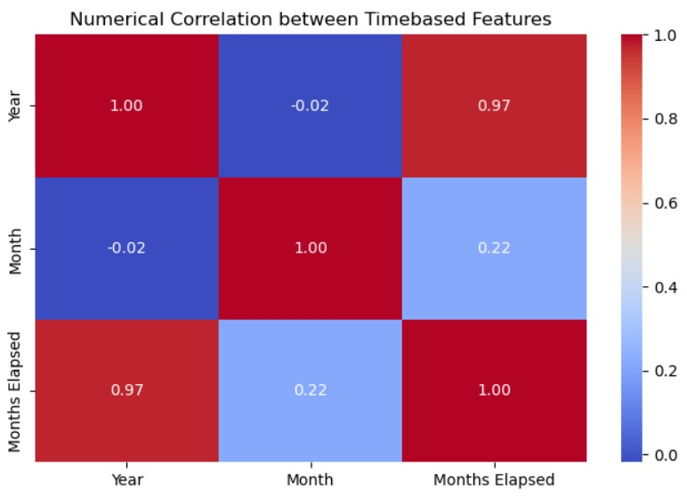
- Prepared data for statistical modeling by adjusting for the skewness and outliers of sales by using winsorization and the logarithm of sales.
- Aggregated features by month and split data into training and testing dataframes.
- Created forecasts for the past 6 months with and without exogenous variables using ARIMA, SARIMA and Holt-Winters.
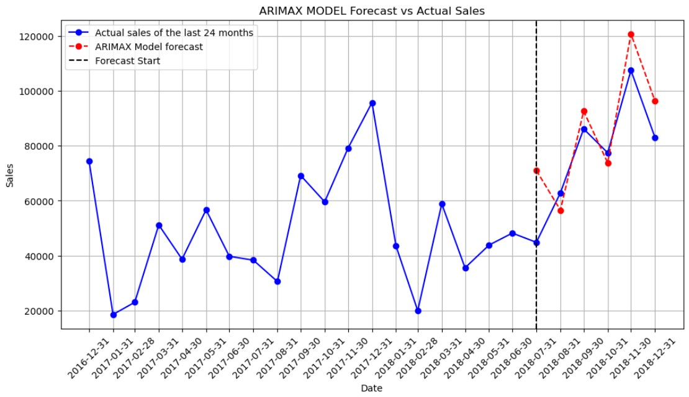
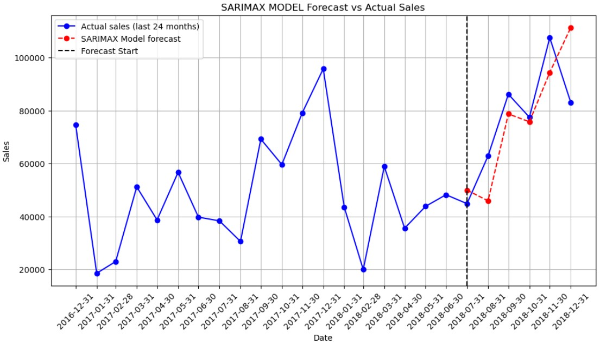
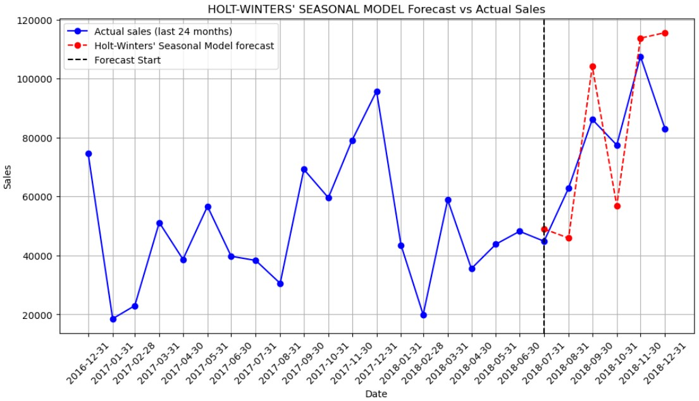
- Evaluated each model on evaluation metrics such as mean absolute percentage error.   

**Model Interpretation**
- Acquired the residuals from the best-performing model's forecast vs the actual historical sales values.
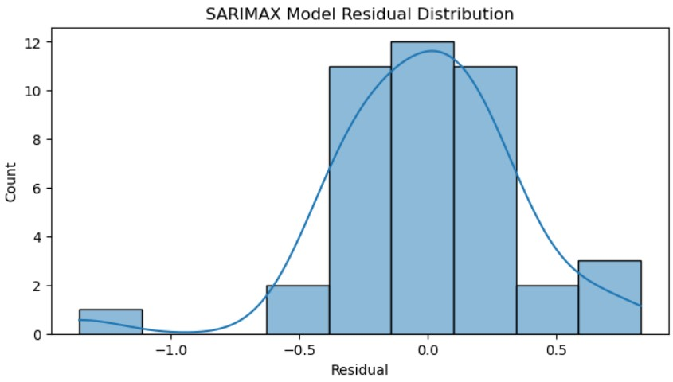
- Visualized the best-performing model's forecast with a 95% confidence interval for the past 6 months.
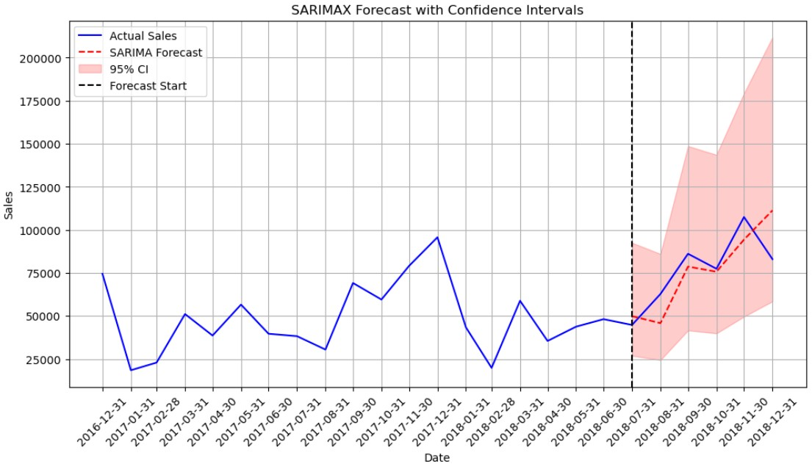
- Compared the cumulative forecasted sales against the cumulative actual sales.
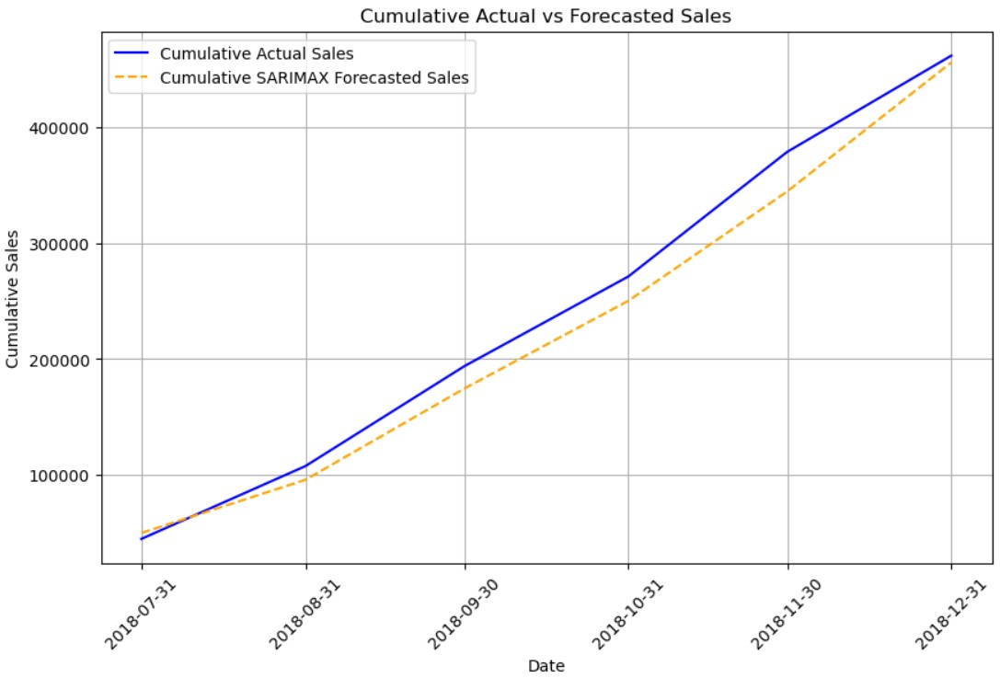 

**Model Deployment**
- Developed a [Streamlit App](https://superstore-time-series-sales-forecasting.streamlit.app/) with interactive total sales filtering and forecasting.
- Saved sales data and generated freezed package versions of dependent packages for the streamlit app to avoid intercompatibility errors.  

## Insights
- More than 75% of sales have a value of less than 210 dollars, with the highest value being more than 22 thousand.
- The sales tend to be the highest in November and the lowest in February.
- The consumer segment is by far the greatest contributor to sales.
- The SARIMAX model has been found to be the best model with a MAPE at about 16%, producing fairly accurate forecasts.  

## Improvements
- Other statistical models such as quantile regression or bayesian structural time series could be used, which may be better at handling the skewness and outliers present in the sales data.
- Other techniques could also be employed to address the sales data's skewness and outliers such as robust scaling or box-cox transformation.
- Acquiring more data such as holidays, where the sales seem to spike, could also be beneficial. 
